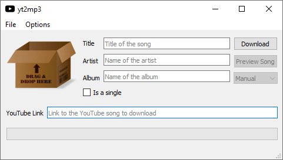
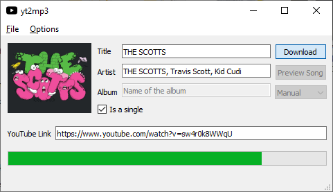

yt2mp3 [](http://unmaintained.tech/)
===
### Converts a youtube video to a mp3 file with ID3 tags



</img>

*Usage (GUI):*
```
Double-click 'ytmp3.py'
```

*Usage (CLI):*
```
python yt2mp3 --yt <youtube link> -a <Artist> -t <title> -c <cover image path>
```

*Arguments:*
- **"--yt"** - Youtube link
- **"-a"** - Artist
- **"-t"** - Title
- **"-c"** - Cover image path
- **"-b"** - Album (OPTIONAL)

*Installation:*
```
pip install -r requirements.txt
```

*To do:*
- Implement SoundCloud API (currently new API keys are not available)
- Implement Spotify API
- Implement YouTube API
- Implement bulk downloading
- Fix memory leaks
